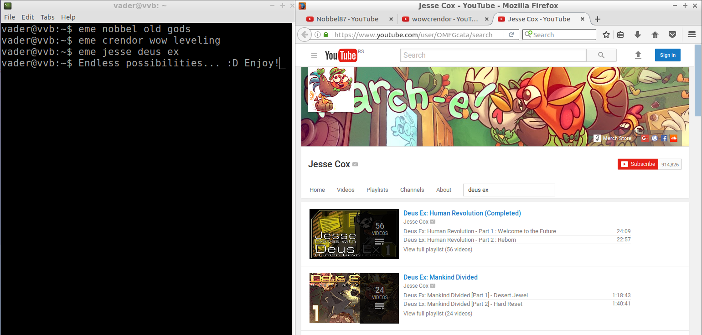

# entertainme



*You're hard at work compiling, testing, deploying etc. your code in the command
line (of course) and you suddenly feel bored and want some quality
entertainment? With **entertainme** you don't need to leave the command line,
just type and be entertained.*

## About

Current version: 0.1

**entertainme** is a console application for opening a browser with a YouTube
page displaying videos from your favorite content creators that you want to
watch. It is made for hard working programmers and the goal is to provide access
to entertainment instantly when they need it.

The application is extendible which means that you can define you own set of
entertainers, I just added some of my favorite ones.

Enjoy!

# Usage and installation

To install locally download the source code and execute Maven command as shown
bellow:

```bash
git clone https://github.com/28/entertainme.git
mvn -PinstallLocally clean install
```

The code works on both Windows and Unix systems. To install you will need to be
in an elevated command prompt (as *Administrator*) if you are on Windows. On
Linux you will be prompted for *root* password. Java 8 and Maven are required
for installation and running.

After this *eme* command should be added to *PATH* and you can use it anywhere.
For example:

```bash
eme jesse skyrim
eme crendor pointless top 10
```

By default the application is installed in ~/.eme directory. Inside, you can
modify a file called *entertainers.properties* and add/remove/modify
entertainer entries at your will. The mapping should be
*'your\_preferred\_nickname=entertainer\_youtube\_user\_name'*. Initial mappings
are located [here](tools/dist/entertainers.properties).

# License

Distributed under
[GNU GENERAL PUBLIC LICENSE Version 2](src/main/resources/META-INF/LICENSE.txt)

Copyright &copy; Dejan Josifović, the paranoid times 2017.
